# End-to-End Workflow: From Payment to Poster

دليل ربط دورة العمل الكاملة (Full Workflow) من بداية الحجز والدفع عبر EasyKash وصولاً إلى توليد البوستر وإرساله.

---

## المخطط العام (Sequence Diagram)

```mermaid
sequenceDiagram
    participant User as العميل
    participant App as Next.js App
    participant DB as Booking DB
    participant EasyKash as EasyKash Gateway
    participant PosterAPI as Poster Generator
    participant WhatsApp as Evolution API

    User->>App: 1. يملأ بيانات الحجز
    App->>DB: إنشاء حجز مبدئي (Pending)
    App->>EasyKash: 2. طلب دفع (Create Payment)
    EasyKash-->>App: رابط الدفع (Redirect URL)
    App-->>User: توجيه لصفحة الدفع
    
    User->>EasyKash: يدخل بيانات البطاقة ويدفع
    EasyKash->>App: 3. Webhook (نجاح الدفع)
    App->>DB: تحديث الحالة (Confirmed)
    
    EasyKash-->>User: إعادة توجيه لصفحة النجاح
    User->>App: تحميل صفحة النجاح (/payment-success)
    
    App->>EasyKash: 4. التحقق من المعاملة (Inquiry)
    EasyKash-->>App: الحالة: PAID
    
    rect rgb(20, 50, 20)
        Note over App, PosterAPI: مرحلة البوستر
        App->>PosterAPI: 5. طلب صورة (OG Image)
        PosterAPI-->>App: يرجع الصورة (PNG)
        App-->>User: عرض البوستر للتحميل
    end
    
    rect rgb(50, 20, 20)
        Note over App, WhatsApp: إرسال واتساب (اختياري)
        App->>WhatsApp: 6. إرسال رسالة مع رابط البوستر
        WhatsApp-->>User: استلام البوستر على الموبايل
    end
```



---

## خطوة بخطوة: كيفية الربط في مشروع جديد

### 1. تجهيز قاعدة البيانات (Database Schema)

تأكد من وجود جدول للحجوزات يحمل هذه البيانات الأساسية:

```sql
create table bookings (
  id uuid primary key default gen_random_uuid(),
  customer_name text,
  phone text,
  status text default 'pending', -- pending, confirmed, failed
  customer_reference text, -- ID بدون فواصل لـ EasyKash
  created_at timestamp with time zone default now()
);
```

### 2. صفحة النجاح (الربط بين الدفع والبوستر)

في ملف `app/payment-success/page.tsx`، بعد التحقق من نجاح الدفع، يمكنك عرض البوستر مباشرة.

```tsx
// app/payment-success/page.tsx

export default async function PaymentSuccessPage({ searchParams }) {
  const { bookingId } = await searchParams;
  
  // 1. تحقق من الدفع مع EasyKash
  const isPaid = await verifyEasyKashPayment(bookingId);
  
  if (isPaid) {
    // 2. هات بيانات العميل من الداتا بيز عشان البوستر
    const booking = await getBooking(bookingId);
    
    // 3. جهز رابط البوستر
    const posterUrl = `/api/og/social-share?name=${encodeURIComponent(booking.customer_name)}&photo=${encodeURIComponent(booking.photo_url)}`;
    
    return (
      <div className="success-screen">
        <h1>تم الحجز بنجاح! 🎉</h1>
        
        {/* عرض البوستر */}
        
        
        {/* زر التحميل */}
        <a href={posterUrl} download="ticket.png">تحميل التذكرة</a>
      </div>
    );
  } else {
    return <div>الدفع لم يكتمل. يرجى المحاولة مرة أخرى.</div>;
  }
}
```

### 3. إرسال البوستر تلقائياً (عبر Webhook)

أفضل مكان لإرسال البوستر هو الـ `api/payment-webhook/route.ts`، لأنه بيشتغل في الخلفية حتى لو العميل قفل الصفحة.

```typescript
// app/api/payment-webhook/route.ts

export async function POST(req) {
  const data = await req.json();
  
  if (data.transaction.status === "SUCCESS") {
    const bookingId = data.transaction.customerReference; // تأكد إنه الـ ID المبسط
    
    // 1. تحديث الداتا بيز
    await updateBookingStatus(bookingId, 'confirmed');
    
    // 2. هات بيانات العميل
    const booking = await getBooking(bookingId);
    
    // 3. ابعت واتساب مع البوستر
    const posterUrl = `https://your-site.com/api/og/social-share?name=${encodeURIComponent(booking.name)}`;
    
    await fetch('https://evolution-api.../sendMedia', {
      method: 'POST',
      body: JSON.stringify({
        number: booking.phone, // لازم 201xxxxxxxxx
        media: posterUrl,
        caption: "تذكرتك جاهزة! 🎫"
      })
    });
  }
  
  return NextResponse.json({ received: true });
}
```

---

## ملفات المشروع التي ستحتاجها

عشان تنقل النظام ده لمشروعك الجديد، انسخ الملفات دي (مع تعديل المسارات):

1. **`app/api/create-booking/route.ts`** (بوابة الدفع - Initiation)
2. **`app/api/verify-transaction/route.ts`** (التحقق - Verification)
3. **`app/api/og/social-share/route.tsx`** (مولد البوستر - OG Image)
4. **`docs/easykash-integration.md`** (دليل الإعدادات)

---

## نصيحة أخيرة 💡

- **EasyKash** حساس جداً للـ `customerReference` وتنسيق رقم الموبايل. استخدم دالة موحدة لتنظيف البيانات (`utils/format.ts`) واستخدمها في كل مكان.
- **OG Image** بيحتاج رابط "عام" (Public URL) للصورة الشخصية للعميل عشان يقدر يعرضها في البوستر. لو العميل بيرفع صورته، ارفعها على استضافة (زي Supabase Storage) وخذ الرابط العام بتاعها.
